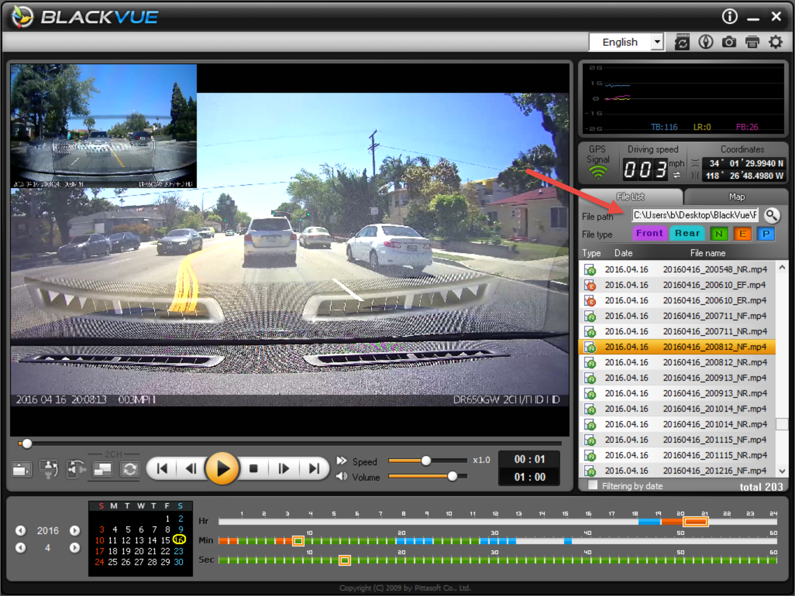

# BlackVue Downloader

BlackVue Downloader was made to facilitate getting images from your [BlackVue Dashcam](http://www.blackvue.com/dr650gw-2ch/) to a hard disk without having to touch the camera.

Without this program, you have to use the [mobile apps](http://www.blackvue.com/support/downloads/), [cloud service](http://www.blackvue.com/blackvue-over-the-cloud/), or you have to unplug the camera, remove the SD Card, place it in a card reader, copy the files, eject the card, put it back into the camera, and plug it back in.  There's got to be a better way...

Fortunately, there is.  BlackVueDownloader connects to your dashcam wirelessly and downloads the video files for viewing, without you having to touch your camera.

## Installation and Usage

1. Download the latest zip of the program from the ["Releases"](https://github.com/morrisonbrett/BlackVueDownloader/releases) tab above and expand the zip into a directory.
2. Connect to the Ad-Hoc WiFi network of the camera.  The default address of the camera is 192.168.1.1.
3. Open a command prompt, or create a scheduled task and run ``> BlackVueDownloader.exe <ipaddress> [destinationdirectory]``.

This will copy the video and GPS files into the 'Record' directory.  The first time you run it, it will take a while, depending on the WiFi throughput you get.

Once the files are downloaded, launch the BlackVue desktop software and point the 'File Path' to your directory.

## Notes

Thank you to this [blog post](https://gadgetblogist.wordpress.com/2014/10/16/dashcam-hacking/) for discovering the protocol that inspired BlackVueDownloader.

This program is written in [.NET Core](https://dotnet.github.io/), and [TDD](https://en.wikipedia.org/wiki/Test-driven_development) with > 90% code coverage.

[This](https://www.facebook.com/morrisonbrett/posts/10154029083504160) is what happens when you let someone else drive your car.  :-\

My personal usage of this program is setup to run as a scheduled task, and it connects as soon as I enter my garage.  It archives all the video footage to a large HD.

## Roadmap

The next major release will have a browser-based UI for setting options and viewing activity as it runs.  It will also facilitate connecting, and looping for continuous runs.

[Contributions](https://github.com/morrisonbrett/BlackVueDownloader#fork-destination-box) welcome!
